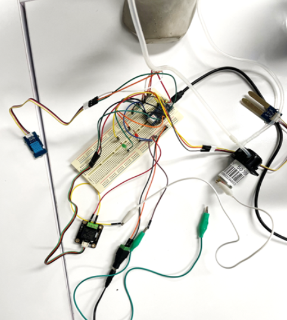

# CiaofromLuigi-Smart-Garden-

## Introduction to the project
Ciao from Luigi is a smart garden as the soil moisture level, air humidity and surrounding temperature is continously detected using sensors and displayed on an Adafruit dashboard to allow monitoring by the owner. The 12V DC peristaltic pump that pumps water from the reservoir into the soil is also configured so that it can be switched on and off on the Adafruit dashboard to allow for remote watering. The aim of a manual watering function is such that the owner still maintains a relationship with the plant and does not rely only on automatic watering to keep the plant alive.
  
A 3 min Youtube video explaining the details of the project can be accessed [here](https://www.youtube.com/watch?v=AcPJYAaz1nI).

## Details of CircuitPython script
CircuitPython script for monitoring Luigi the plant’s health using an Adafruit dashboard. 
  

  
[Grove temperature and humidity sensor](https://wiki.seeedstudio.com/Grove-TemperatureAndHumidity_Sensor/) as well as [Grove moisture sensor](https://wiki.seeedstudio.com/Grove-Moisture_Sensor/) are used to monitor environment temperature, air humidity and soil moisture levels respectively. The sensors are connected to WiFi-enabled [Arduino Nano RP2040](https://docs.arduino.cc/hardware/nano-rp2040-connect) to allow for the readings taken every hour to be published and displated on an Adafruit dashboard.
  

  
The script also publishes specific preset messages on the message feed on Adafruit when the plant is under sub-optimal conditions defined by moisture, temperature and humidity thresholds set in the script. The messages remind the owner to water the plant or to perform other necessary actions such as move the plant into a shader area. Additionally, the red LED light turns on when the plant needs water, and conversely, the green LED light turns on when the plant is sufficiently watered. If the plant is not watered, the script will continue sending reminders to water the plant every 10 min until the owner waters the plant. The script also sends the owner a random preset motivational quote every 24 hours.
     Image of plant taken from [here](https://www.vecteezy.com/vector-art/3226944-cute-ornamental-plant-icon-cartoon-illustration).  
When a new message is published to the message feed on Adafruit (trigger), the applet designed on IFTTT emails the message to the owner (output) [Published applet](https://ifttt.com/applets/CUZQrvq2-message-channel-for-ciao-from-luigi) This can be when Luigi the plant requires additional actions such as watering or when it has been 24 hrs since the last motivational message so that a new random motivational message can be sent.

The code for connecting to WiFi, callback functions and initialising the MQTT Client is adapted from [here](https://learn.adafruit.com/quickstart-rp2040-pico-with-wifi-and-circuitpython/usage-with-adafruit-io).
